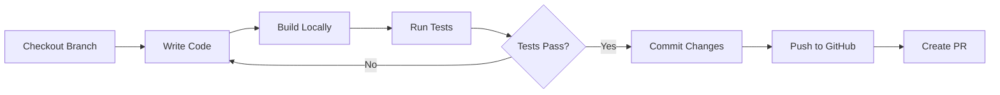
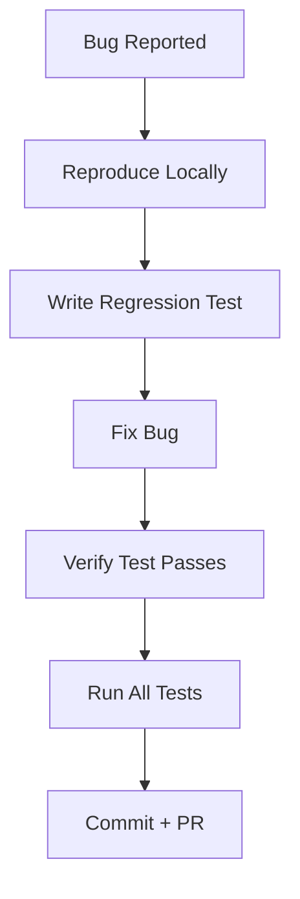
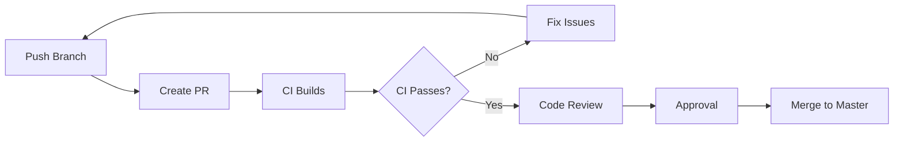
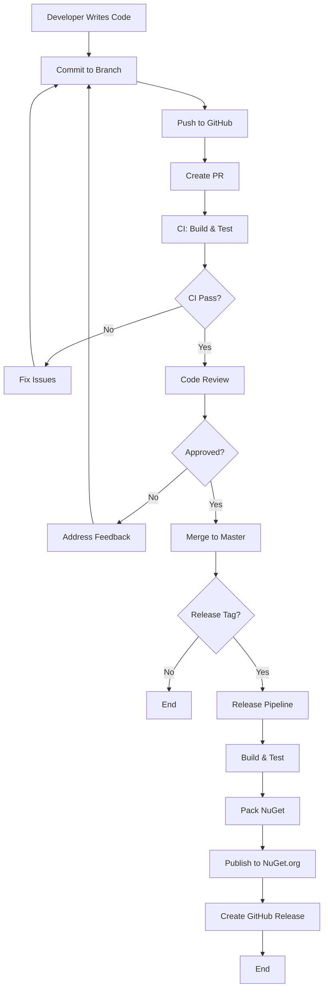

# Workflow Analysis

This document analyzes developer workflows, CI/CD pipelines, release management processes, and identifies automation opportunities and bottlenecks in the XperienceCommunity.DataContext project.

---

## Developer Workflows

### 1. Local Development Workflow

#### Setup (One-Time)
```bash
# Clone repository
git clone https://github.com/brandonhenricks/xperience-community-data-context.git
cd xperience-community-data-context

# Install prerequisites
# - .NET 8 SDK (8.0.100+)
# - .NET 9 SDK (9.0.100+)

# Restore dependencies
dotnet restore

# Build solution
dotnet build

# Run tests
dotnet test
```

**Duration**: ~5-10 minutes (first-time setup)

#### Daily Development Loop


**Typical Duration**: 30-60 minutes per feature

**Commands**:
```bash
# Create feature branch
git checkout -b feature/my-feature

# Iterative development
dotnet build
dotnet test

# Commit and push
git add .
git commit -m "feat: Add new feature"
git push origin feature/my-feature
```

### 2. Feature Development Workflow

#### Adding New Expression Support
**Steps**:
1. Create processor in `src/.../Expressions/Processors/`
2. Implement `IExpressionProcessor<TExpression>`
3. Register in `ContentItemQueryExpressionVisitor`
4. Add tests in `tests/.../ProcessorTests/`
5. Update documentation

**Example**:
```bash
# 1. Create processor
code src/XperienceCommunity.DataContext/Expressions/Processors/NewExpressionProcessor.cs

# 2. Create tests
code tests/XperienceCommunity.DataContext.Tests/ProcessorTests/NewExpressionProcessorTests.cs

# 3. Build and test
dotnet build
dotnet test --filter "FullyQualifiedName~NewExpressionProcessorTests"

# 4. Run all tests
dotnet test
```

**Estimated Time**: 2-4 hours (processor + tests + documentation)

#### Adding New Context Type
**Steps**:
1. Create interface in `Abstractions/`
2. Create implementation in `Contexts/`
3. Create executor in `Executors/`
4. Register in `DependencyInjection.cs`
5. Add factory method to `IXperienceDataContext`
6. Add tests
7. Update README.md

**Estimated Time**: 4-8 hours (complex, touches multiple layers)

### 3. Bug Fix Workflow



**Steps**:
```bash
# Create bug fix branch
git checkout -b fix/issue-123

# Write failing test
dotnet test --filter "FullyQualifiedName~BugReproductionTest"

# Fix and verify
dotnet build
dotnet test

# Commit
git add .
git commit -m "fix: Resolve issue #123"
git push origin fix/issue-123
```

**Estimated Time**: 1-3 hours (depending on complexity)

---

## CI/CD Pipeline

### 1. Build & Test Pipeline (.github/workflows/dotnet.yml)

**Triggers**:
- Push to `master` branch
- Pull requests targeting `master`

**Steps**:
```yaml
1. Checkout code (actions/checkout@v4)
2. Setup .NET 9.x SDK (actions/setup-dotnet@v4)
3. Restore dependencies (dotnet restore)
4. Build solution (dotnet build --no-restore --configuration Release)
5. Run tests (dotnet test --configuration Release --logger trx)
6. Upload test results (actions/upload-artifact@v4)
```

**Duration**: ~2-5 minutes

**Environment**: Ubuntu Latest (Linux)

**Success Criteria**:
- Build succeeds with no errors
- All tests pass
- No compiler warnings in Release configuration

**Failure Actions**:
- PR is blocked from merging
- Notification sent to PR author
- Test results artifact available for review

### 2. Release Pipeline (.github/workflows/release.yml)

**Triggers**:
- Push of version tag (e.g., `v1.0.0`, `v1.2.3-alpha`)
- Manual workflow dispatch (for emergency releases)

**Steps**:
```yaml
1. Checkout code
2. Verify commit exists in master branch
3. Extract version from tag
4. Validate version format (x.y.z or x.y.z-suffix)
5. Generate release notes from commits
6. Setup .NET 9.x SDK
7. Restore dependencies
8. Build solution (Release configuration)
9. Run tests (must pass)
10. Pack NuGet package (dotnet pack)
11. Publish to NuGet.org
12. Create GitHub Release
```

**Duration**: ~5-10 minutes

**Environment**: Ubuntu Latest (Linux)

**Version Extraction**:
```bash
# From tag: v1.2.3 → VERSION=1.2.3
# From manual: User input → VERSION={input}
```

**Release Notes Generation**:
- Automatically extracts commits from merged PR
- Includes commit messages with short hashes
- Formatted as markdown bullet list

**Success Criteria**:
- Build succeeds
- All tests pass
- NuGet package created
- Package published to NuGet.org
- GitHub Release created with notes

---

## Pull Request Workflow

### PR Creation


**Checklist for PR Author**:
- [ ] Branch name follows convention (`feature/`, `fix/`, `chore/`)
- [ ] Commit messages follow Conventional Commits (feat:, fix:, chore:)
- [ ] All tests pass locally
- [ ] New tests added for new features
- [ ] Documentation updated (if applicable)
- [ ] No merge conflicts with master
- [ ] PR description includes context and changes

**Checklist for Reviewer**:
- [ ] Code follows SOLID principles
- [ ] No obvious performance issues
- [ ] Tests cover edge cases
- [ ] Documentation is clear
- [ ] No breaking changes (or properly documented)
- [ ] CI pipeline passes

**Average PR Lifecycle**: 1-3 days (from creation to merge)

---

## Release Management

### Versioning Strategy
**Semantic Versioning (SemVer)**:
- **MAJOR**: Breaking changes (e.g., 1.x.x → 2.0.0)
- **MINOR**: New features, backward compatible (e.g., 1.2.x → 1.3.0)
- **PATCH**: Bug fixes, backward compatible (e.g., 1.2.3 → 1.2.4)

**Pre-release Suffixes**:
- `-alpha`: Early preview (e.g., 1.0.0-alpha)
- `-beta`: Feature complete, testing (e.g., 1.0.0-beta)
- `-rc`: Release candidate (e.g., 1.0.0-rc1)

### Release Process

#### 1. Prepare Release
```bash
# Ensure master is up to date
git checkout master
git pull origin master

# Review changes since last release
git log v1.2.0..HEAD --oneline

# Update version in Directory.Build.props
# <VersionPrefix>1.3.0</VersionPrefix>

# Update CHANGELOG.md (if exists)

# Commit version bump
git add .
git commit -m "chore: Bump version to 1.3.0"
git push origin master
```

#### 2. Create Release Tag
```bash
# Create and push version tag
git tag -a v1.3.0 -m "Release 1.3.0"
git push origin v1.3.0
```

#### 3. Monitor CI/CD
- GitHub Actions automatically triggers release workflow
- Monitor progress in Actions tab
- Verify NuGet package is published

#### 4. Verify Release
```bash
# Check NuGet.org
https://www.nuget.org/packages/XperienceCommunity.DataContext/

# Test installation in sample project
dotnet new console -n TestApp
cd TestApp
dotnet add package XperienceCommunity.DataContext --version 1.3.0
dotnet restore
```

#### 5. Announce Release
- GitHub Release notes auto-generated
- Update project README with latest version
- Notify community (if applicable)

**Total Duration**: 30-60 minutes (manual steps + automation)

---

## Automation Opportunities

### High-Priority Opportunities

#### 1. Automated Version Bumping
**Current**: Manual version update in Directory.Build.props
**Proposed**: Automated semantic versioning based on commit messages

**Implementation**:
```yaml
# GitHub Action: Conventional Changelog
- uses: mathieudutour/github-tag-action@v6.1
  with:
    github_token: ${{ secrets.GITHUB_TOKEN }}
    default_bump: patch
    tag_prefix: v
```

**Benefits**:
- Eliminates manual version management
- Enforces Conventional Commits
- Auto-generates changelogs

**Estimated Time Saved**: ~15 minutes per release

#### 2. Automated Dependency Updates
**Current**: Manual dependency checking and updates
**Proposed**: Dependabot automated PRs for dependency updates

**Configuration**:
```yaml
# .github/dependabot.yml
version: 2
updates:
  - package-ecosystem: "nuget"
    directory: "/"
    schedule:
      interval: "weekly"
    open-pull-requests-limit: 5
```

**Benefits**:
- Security vulnerability patches
- Automatic compatibility testing
- Reduced maintenance burden

**Estimated Time Saved**: ~1 hour per month

#### 3. Code Coverage Reporting
**Current**: Coverage collected but not reported
**Proposed**: Upload coverage to Codecov/Coveralls

**Implementation**:
```yaml
- name: Upload coverage to Codecov
  uses: codecov/codecov-action@v3
  with:
    files: ./TestResults/*/coverage.cobertura.xml
```

**Benefits**:
- Visibility into coverage trends
- PR checks for coverage regressions
- Public coverage badges

**Estimated Value**: High (improves code quality)

### Medium-Priority Opportunities

#### 4. Automated Performance Benchmarking
**Current**: No automated performance tracking
**Proposed**: BenchmarkDotNet integration with regression detection

**Example Workflow**:
```yaml
- name: Run Benchmarks
  run: dotnet run -c Release --project benchmarks/
  
- name: Compare Results
  run: dotnet bdn-compare baseline current
```

**Benefits**:
- Early detection of performance regressions
- Optimization tracking over time

**Estimated Setup**: 4-8 hours

#### 5. Stale Issue/PR Management
**Current**: Manual issue triage
**Proposed**: GitHub Actions to auto-close stale issues

**Configuration**:
```yaml
# .github/workflows/stale.yml
- uses: actions/stale@v8
  with:
    stale-issue-message: 'This issue has been marked as stale due to inactivity.'
    days-before-stale: 60
    days-before-close: 14
```

**Benefits**:
- Keeps issue tracker clean
- Focuses attention on active issues

### Low-Priority Opportunities

#### 6. Automated Documentation Generation
**Current**: Manual documentation updates
**Proposed**: Auto-generate API docs from XML comments

**Tools**: DocFX or dotnet-doc

**Benefits**:
- Always up-to-date documentation
- Reduced manual effort

**Estimated Setup**: 8-16 hours

---

## Identified Bottlenecks

### 1. Manual Release Process
**Impact**: Medium
**Current Time**: 30-60 minutes per release
**Issue**: Version bumping, changelog updates, tag creation are manual

**Solutions**:
- Implement automated version bumping (see Automation #1)
- Use Conventional Commits + automated changelog generation

### 2. Test Execution Time
**Impact**: Low
**Current Time**: ~2-3 minutes (acceptable)
**Issue**: May grow as test suite expands

**Solutions**:
- Test parallelization (already enabled)
- Test categorization (run fast tests first)
- Consider test sharding for future growth

### 3. PR Review Latency
**Impact**: Medium
**Current Time**: 1-3 days average
**Issue**: Depends on reviewer availability

**Solutions**:
- Set up automated code review (GitHub Code Scanning)
- Define SLA for PR reviews (e.g., 24 hours)
- Add more reviewers/maintainers

### 4. Dependency Update Process
**Impact**: Low
**Current Time**: ~1 hour per month
**Issue**: Manual checking and testing

**Solutions**:
- Implement Dependabot (see Automation #2)
- Auto-merge minor/patch updates if CI passes

---

## Workflow Metrics & KPIs

### Current Metrics
| Metric | Current Value | Target | Status |
|--------|---------------|--------|--------|
| Build Time | 2-3 minutes | < 5 minutes | ✅ Good |
| Test Pass Rate | 99%+ | 100% | ✅ Good |
| PR Merge Time | 1-3 days | < 1 day | ⚠️ Can Improve |
| Release Frequency | As needed | Monthly | ℹ️ Variable |
| Test Coverage | ~75% | 80%+ | ⚠️ Can Improve |

### Recommended KPIs to Track
1. **Lead Time for Changes**: Time from commit to production (tag push to NuGet publish)
   - **Target**: < 15 minutes
   - **Current**: ~10 minutes (automated)

2. **Deployment Frequency**: How often releases are published
   - **Target**: Monthly or as needed
   - **Current**: On-demand (good for library)

3. **Mean Time to Recovery (MTTR)**: Time to fix and deploy bug fixes
   - **Target**: < 24 hours for critical bugs
   - **Current**: Not tracked

4. **Change Failure Rate**: % of releases causing issues
   - **Target**: < 5%
   - **Current**: Not tracked (recommend tracking)

---

## Best Practices Recommendations

### For Contributors
1. **Always run tests locally before pushing**
   ```bash
   dotnet test
   ```

2. **Follow Conventional Commits**
   ```
   feat: Add new expression processor
   fix: Resolve null reference in cache
   chore: Update dependencies
   ```

3. **Keep PRs small and focused** (< 500 lines changed)

4. **Write meaningful PR descriptions** (problem, solution, testing)

5. **Respond to PR feedback within 24 hours**

### For Maintainers
1. **Review PRs within 24 hours** (or assign another reviewer)

2. **Run additional smoke tests for critical changes**

3. **Use "Squash and Merge" for clean git history**

4. **Create releases monthly or for urgent fixes**

5. **Monitor CI/CD pipelines for flakiness**

---

## Workflow Diagram Summary



---

**Last Updated**: December 28, 2025
**Workflow Review**: Quarterly
**Automation Progress**: 60% (High-priority opportunities identified)
